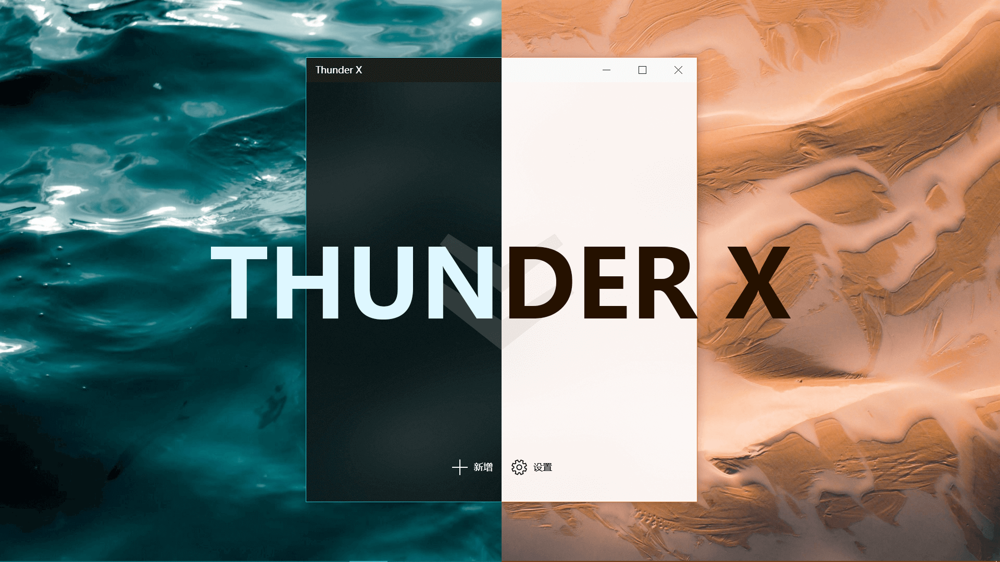

# Thunder X

Thunder X is a multi-threaded download tool that provides excellent interface and extremely high download speeds. Download Thunder X in Windows Store or click [here](https://www.microsoft.com/en-us/p/thunder-x/9njqw2wdtd43?activetab=pivot:overviewtab).

This software runs on universal windows platform.

## Branches

This project has two branches. `master` represents the latest stable release. `develop` is used to deploy the code to be published.

## Update List

### 1.8.0.0

- Steadier core downloader
- Reduced startup time
- Automatic reconnection
- Fix a bug: The time predictions of suspended tasks will change.
- Fix a bug: A "file not exist" exception may be throwed after a task is removed.
- Several UI improvements

### 1.7.10.0

- Fix an issue that occurs when a task is paused
- Several UI adjustments
- Provides messages of URL analyses in details

### 1.7.9.0

- Several bugs are fixed
- Download stability has been improved
- Interface adjustments at "New Task" page

### 1.7.7.0

- Illegal link will not cause crashes now
- The Chinese translation of notifications has been improved
- Software can better guess the target file's extension
- Interface adjustments

## Privacy Policy

Visit [PRIVACY_POLICY](https://github.com/MilesChing/ThunderX/blob/develop/PRIVACY_POLICY.md) to learn about our privacy policy.

## License

Copyright © 2019 MilesChing

Permission is hereby granted, free of charge, to any person obtaining a copy of this software and associated documentation files (the “Software”), to deal in the Software without restriction, including without limitation the rights to use, copy, modify, merge, publish, distribute, sublicense, and/or sell copies of the Software, and to permit persons to whom the Software is furnished to do so, subject to the following conditions:

The above copyright notice and this permission notice shall be included in all copies or substantial portions of the Software.

THE SOFTWARE IS PROVIDED “AS IS”, WITHOUT WARRANTY OF ANY KIND, EXPRESS OR IMPLIED, INCLUDING BUT NOT LIMITED TO THE WARRANTIES OF MERCHANTABILITY, FITNESS FOR A PARTICULAR PURPOSE AND NONINFRINGEMENT. IN NO EVENT SHALL THE AUTHORS OR COPYRIGHT HOLDERS BE LIABLE FOR ANY CLAIM, DAMAGES OR OTHER LIABILITY, WHETHER IN AN ACTION OF CONTRACT, TORT OR OTHERWISE, ARISING FROM, OUT OF OR IN CONNECTION WITH THE SOFTWARE OR THE USE OR OTHER DEALINGS IN THE SOFTWARE.
